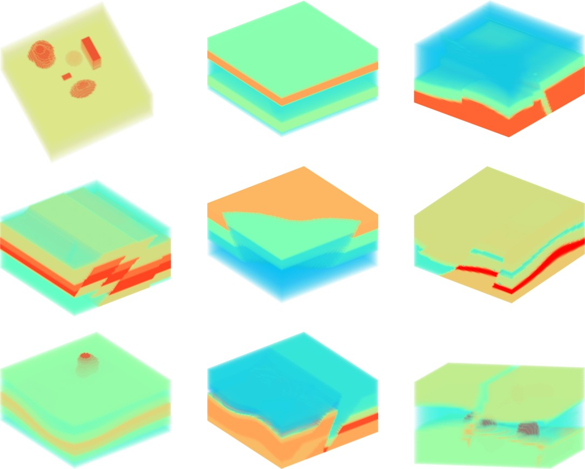

# OpenEM
OpenEM: Large-scale multi-structural 3D datasets for electromagnetic methods.



Dataset can be downloaded from [here](https://huggingface.co/datasets/ws11/OpenEM)

# Forward 
This is the code implementation of the forward model of "OpenEM: Large-scale multi-structural 3D datasets for electromagnetic methods"

# Train

## Installation
run:
```
pip install -r requirements.txt
```
## Training models

### Preparing Data

The training code reads ‘npy’ data from a directory of data files. 

```
data_dir
│       
└───train
│   │
│   └───data_type1
│       │   
│       └───data
│       │   │   file021.npy
│       │
│       └───mdoel  
│       │   │   file021.npy
│       │
│       └───height  
│           │   file021.npy
└───val
    │
    └───data_type1
        │   
        └───data
        │   │   file031.npy
        │
        └───mdoel  
        │   │   file031.npy
        │
        └───height  
            │   file031.npy
``` 

Specify 'train_dir' and 'val_dir' inside main DataModule.

## training
```
python main.py
```
You may also want to train in a distributed manner. In this case, Specify 'accelerator' and 'devices' in the 'Trainer'.

The logs and saved models will be written to a logging directory determined by the 'dirpath' in main.

Checkpoint can be downloaded from: https://huggingface.co/datasets/ws11/OpenEM.

## Test
```bash
python test.py
```
Note that you should specify 'checkpoint' and 'noise_data' in the 'test'.


